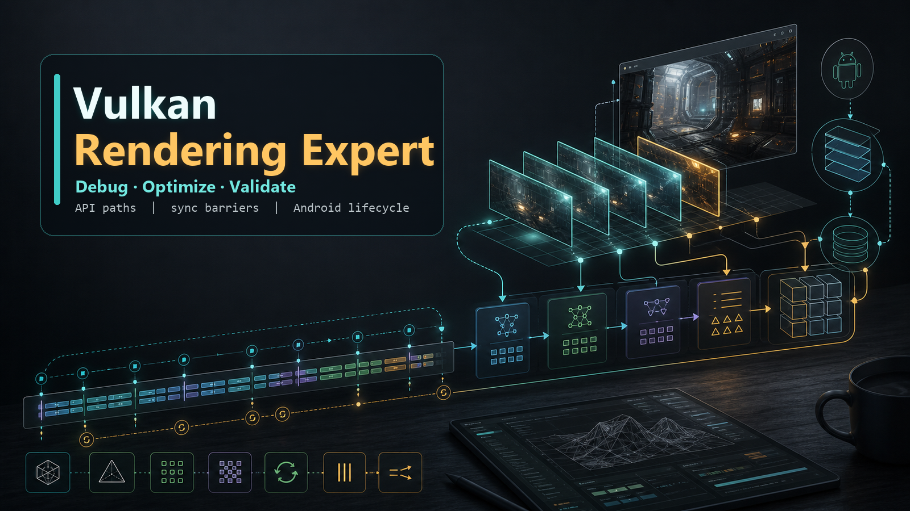

# Vulkan 渲染专家技能



这是一个 Vulkan 渲染工程专家技能包。它不是 Vulkan 入门教程，而是为真实渲染工程任务准备的运行时知识库：用于在处理 Vulkan 设计、实现、调试、优化和验证问题时，按工程链路组织判断、引用规则、API 细节、调试路径和回归验证。

## 适用场景

- 设计 Vulkan 渲染管线、Render Pass、Dynamic Rendering、Render Graph 或 RHI 抽象。
- 实现或修改 Descriptor、Pipeline、Command Buffer、Buffer/Image、Swapchain、同步和资源生命周期代码。
- 排查黑屏、闪烁、崩溃、GPU hang、device lost、Validation Error、image layout、descriptor binding 等问题。
- 分析移动端 Vulkan 性能瓶颈，包括 bandwidth、fullscreen pass、barrier、descriptor 更新和 pipeline 创建卡顿。
- 处理 Android Vulkan 的 `ANativeWindow`、Surface 生命周期、pause/resume、横竖屏和 swapchain recreate。
- 在不确定 API 细节时，区分规范来源、经验判断和需要回查的内容。

## 技能结构

```text
.
├── SKILL.md                 # 技能入口，定义触发、加载顺序和输出规则
├── agents/                  # 可选的工具或平台集成配置
├── assets/                  # README 和发布页使用的图片资产
└── references/              # Vulkan 专家知识库，按任务渐进加载
```

`references/` 按职责拆分为 8 个模块：

| 模块 | 作用 |
|---|---|
| `00_expert_entry` | 角色、硬规则、任务分类、输出格式、调试/性能优先级 |
| `01_source_map_and_api_manual_strategy` | 来源等级、引用规则、API 卡片写作策略 |
| `02_core_mental_model` | Vulkan 对象链路、帧生命周期、资源生命周期、同步模型 |
| `03_api_manual` | API 卡片、生命周期索引、错误索引和 Vulkan API 细节 |
| `04_debug_playbooks` | 黑屏、闪烁、崩溃、Validation Error、同步和性能排查手册 |
| `05_workflows` | Renderer、Pass、Compute、Android 集成、资源管理和优化工作流 |
| `06_cases` | 真实工程案例、误判复盘、根因、修复和经验抽象 |
| `07_integration_pack` | 模块依赖、任务路由、检索策略和 token 使用规则 |

## 核心能力

这个技能要求输出始终给出可执行的 Vulkan 路径，而不是停留在概念解释：

1. 先给结论和最高优先级判断。
2. 给出 Vulkan 对象链路、关键 API、资源状态、layout 或同步关系。
3. 标出 descriptor、pipeline、command buffer、image layout、lifetime、Android lifecycle 等高风险点。
4. 给出最小验证方式，例如 Validation Layer、RenderDoc、AGI、logcat、trace、counter 或 targeted assert。
5. 对不确定 API 细节明确要求回查 Vulkan Spec、Registry、官方示例或平台文档。

## 使用方式

把仓库根目录作为技能目录使用即可。技能入口是根目录下的 `SKILL.md`，运行时资料在 `references/` 中按需加载。

示例任务：

```text
排查 Android Vulkan 前后台切换后黑屏的问题，给出对象链路、最可能原因和验证步骤。
```
