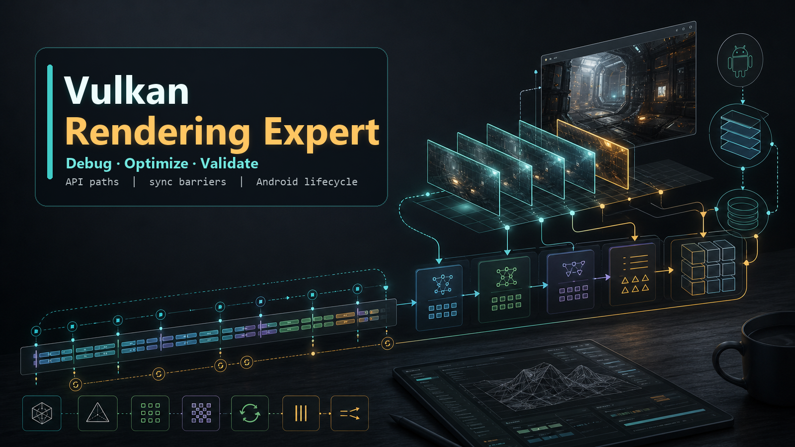

# Vulkan Rendering Expert Skill

English | [中文](README.md)



This is a Vulkan rendering engineering expert skill package. It is not a Vulkan beginner tutorial, but a runtime knowledge base prepared for real rendering engineering tasks: when handling Vulkan design, implementation, debugging, optimization, and verification problems, it organizes judgments, citation rules, API details, debugging paths, and regression verification along engineering pipelines.

## Use Cases

- Designing Vulkan rendering pipelines, Render Passes, Dynamic Rendering, Render Graphs, or RHI abstractions.
- Implementing or modifying Descriptor, Pipeline, Command Buffer, Buffer/Image, Swapchain, synchronization, and resource lifecycle code.
- Debugging black screens, flickering, crashes, GPU hangs, device lost, Validation Errors, image layouts, descriptor binding, and similar issues.
- Analyzing mobile Vulkan performance bottlenecks, including bandwidth, fullscreen passes, barriers, descriptor updates, and pipeline creation stutter.
- Handling Android Vulkan `ANativeWindow`, Surface lifecycle, pause/resume, orientation changes, and swapchain recreation.
- Distinguishing between specification facts, engineering judgment, and items requiring lookup when API details are uncertain.

## Skill Structure

```text
.
├── SKILL.md                 # Skill entry: triggers, loading order, and output rules
├── agents/                  # Optional tool or platform integration configs
├── assets/                  # Image assets used by README and release pages
└── references/              # Vulkan expert knowledge base, progressively loaded by task
```

`references/` is split into 8 modules by responsibility:

| Module | Purpose |
|---|---|
| `00_expert_entry` | Role, hard rules, task classification, output formats, debugging/performance priorities |
| `01_source_map_and_api_manual_strategy` | Source tiers, citation rules, API card writing strategy |
| `02_core_mental_model` | Vulkan object chains, frame lifecycle, resource lifecycle, synchronization model |
| `03_api_manual` | API cards, lifecycle index, error index, and Vulkan API details |
| `04_debug_playbooks` | Playbooks for black screens, flickering, crashes, Validation Errors, synchronization, and performance |
| `05_workflows` | Renderer, Pass, Compute, Android integration, resource management, and optimization workflows |
| `06_cases` | Real engineering cases, misdiagnosis retrospectives, root causes, fixes, and distilled lessons |
| `07_integration_pack` | Module dependencies, task routing, retrieval policy, and token usage rules |

## Core Capabilities

This skill requires output to always provide actionable Vulkan paths rather than stopping at conceptual explanations:

1. Lead with the conclusion and the highest-priority judgment.
2. Provide the Vulkan object chain, key APIs, resource states, layouts, or synchronization relationships.
3. Flag high-risk points such as descriptors, pipelines, command buffers, image layouts, object lifetimes, and the Android lifecycle.
4. Give the minimal verification approach, e.g. Validation Layer, RenderDoc, AGI, logcat, traces, counters, or targeted asserts.
5. Explicitly require looking up the Vulkan Spec, Registry, official samples, or platform docs when API details are uncertain.

## Usage

Use the repository root as the skill directory. The skill entry is `SKILL.md` at the root; runtime materials are loaded on demand from `references/`.

Example task:

```text
Debug an Android Vulkan black screen that appears after app pause/resume: give the object chain, the most likely causes, and verification steps.
```
